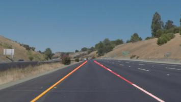

# Udacity carnd Project1 : Finding Lane Lines on the Road

[](http://www.udacity.com/drive)

[image1]: ./examples/laneLines_thirdPass.jpg "lane lines"
[image2]: ./sample_images/p1_step8.jpg "lane lines"




## Overview
---
When we drive, we use our eyes to decide where to go.  The lines on the road that show us where the lanes are act as our constant reference for where to steer the vehicle.  Naturally, one of the first things we would like to do in developing a self-driving car is to automatically detect lane lines using an algorithm.

In this project I have tried to detect lane lines in images using Python and OpenCV.  OpenCV means "Open-Source Computer Vision", which is a package that has many useful tools for analyzing images.

To find out more details of project you can refer [project writeup](https://github.com/sandysap22/udacity_carnd_project1/blob/master/Project1_writeup.md)

The project specifications can be found in [project rubric](https://review.udacity.com/#!/rubrics/322/view)

To view details of steps that are followed you can refer P1.ipynb.

***Please note that the notebook has become heavy (around 15 mb) due to lot of images into it. So it will take a while to load it in browser***

## How to set up project in your machine. 
---
1. Install miniconda
2. Get this repository on your machine 
    ```
    > git clone https://github.com/sandysap22/udacity_carnd_project1.git
    ```
3. Got to setup_details folder and hit conda command to get all required software. Note that if you are on windows then need to rename windows_meta.yml to meta.yml
    ```
    > conda env create -f environment.yml
    ```
4. Activate your newly created environment.
    ```
    > source activate carnd-term1
    ```
5. Run jupyter server, go to root of project and hit below command
    ```
    > jypyter notebook
    ```
6. Open project in browser [http://localhost:8888/tree] and click on P1.ipynb and start to exploring the pipeline that finds lane lines in videos.

***Please note that the notebook has become heavy (around 15 mb) due to lot of images into it. So it will take a while to load it in browser***
  